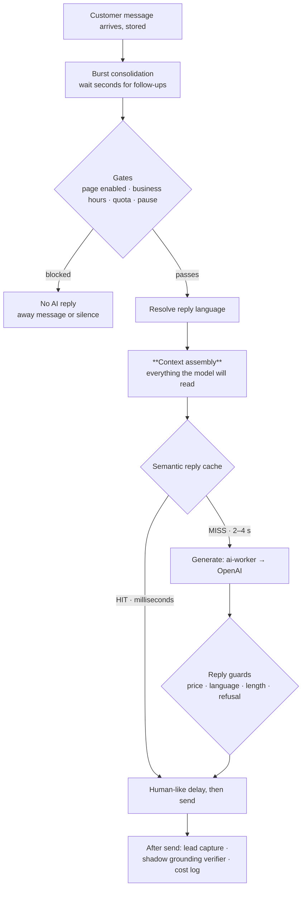
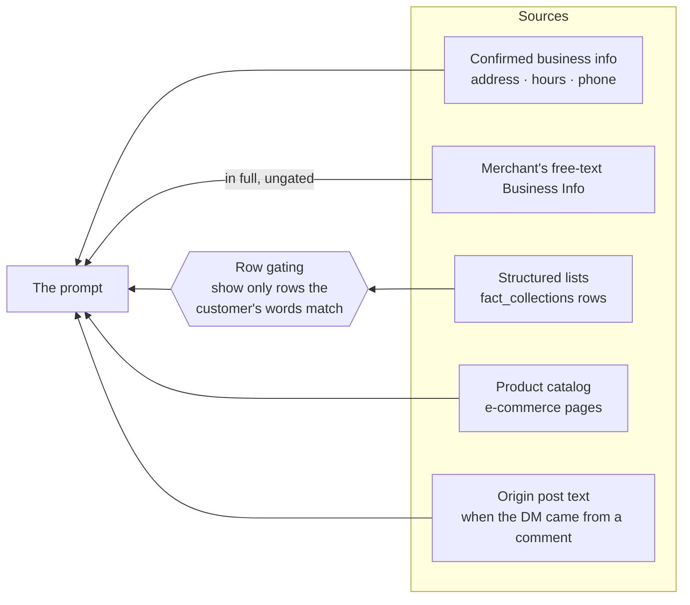

# Anatomy of one reply

How a single customer message becomes a sent reply, what the model is allowed to read, what
guards the output — and **where each known defect class lives**. Keep this current: it is the
map used when triaging "why did the AI say that?".

> Update this file whenever the reply path changes — a new context block, a new guard, a new
> gate, or a defect class closed. A stale map sends the next investigation down the wrong path
> (Rule 15).

## The ten stages

Only **stage E** decides what the reply *says*. Everything after it guards or ships.

⚠️ The cache HIT path skips the model call entirely. That is why bumping `PROMPT_VERSION`
is the most expensive change in the product: it retires every cache key, so every merchant's
replies fall back to the 2–4 s path until the cache re-warms (Rule 17).

## Stage E — what the model is allowed to read

| Source | Gated? | Notes |
|---|---|---|
| Confirmed business info | no | `businessInfoPrompt.ts`; provenance-gated (confirmed fields only) |
| Free-text Business Info | **no — enters in full** | whole-KB injection for non-e-commerce pages (D-050); RAG only for e-commerce |
| Structured lists | **yes** | `factCollections.ts` → `factCollectionsMatcher.ts` → `factCollectionsRenderer.ts` |
| Product catalog | no | `renderCatalogPromptBlock` |
| Origin post | no | posts < 60d, ≤ 500 chars (#467) |

**Row gating**, the only place where we withhold data on purpose:

1. **Key gate** — match the customer's words against the collection's stored *key* values;
   show only the rows carrying a matched key. Nothing matched ⇒ no rows, but the derived
   coverage statement still renders. Measured: place fabrication 28% → 0%.
2. **Sub-key narrowing** (2026-08-06, PR #650) — further narrow by any *other* attribute value
   the customer named, scoped to what the key match reaches. Measured: 6/8 → 0/40.
   A row that does not carry the constrained label is **unconstrained**, never withheld.
3. **Expiry** — a dated row leaves the prompt the day after it starts (D-057).

⛔ Withholding is a two-edged tool. Four separate false-denial bugs were found in this gate
during one day of review; the worst denied five real course cohorts to a customer who merely
wrote «أنا مبتدئ». **A false denial loses a sale — it is worse than the fabrication being
prevented.** Watch `metrics:facts:rows_emptied_subkey`; roll back with `FACT_LIST_MODE=list`.

## Where each defect class lives

| Class | What the customer sees | Where it lives | Status |
|---|---|---|---|
| **A — neighbouring-row borrowing** | asks about a level with no announced cohort, gets another level's date/days/time verbatim | structured lists, before the gate | ✅ closed by PR #650 (6/8 → 0/40) |
| **B — another product's price** | «طرفين 69» (a hair-oil offer) applied to an incense collection ⇒ quoted 207 instead of 357 | free-text Business Info (ungated) **and** the price guard, which asks "is this number in the KB?" not "is it a price *of this product*?" | 🔴 open — `~/.claude/plans/price-product-scoping-2026-08-06.md` |
| **C — verifier blind to recombination** | a reply welded from two records passes, because every atomic claim is supported *somewhere* | after send, shadow grounding verifier | 🔴 open |

**The single thread through all three: a value gets separated from the record it belongs to.**
A price from its product, a date from its level, a sentence from its source. So the fix is always
*binding*, never *instructing* — do not ask the model to avoid the mistake; do not put the
mis-combinable material in front of it.

## Two results measured the hard way

| Attempt | Result |
|---|---|
| A prompt sentence forbidding cross-record mixing | 6/8 → 5/8 — **neutral** |
| A prompt rule about near-name matching | 8/48 → 8/48 — **neutral** |
| Moving the same decision into code (the gate) | 6/8 → **0/40** |

⛔ Do not re-propose either prompt approach without new evidence. A decision with a decidable
answer belongs in code; the model is for language→symbol mapping only.

## Reach — why one fix ≠ one improvement for everyone

Gating requires structured lists. Of **118** pages (**26** live), **5** have any
`fact_collections`, and only pages whose *keyed* collection has rows carrying a second
attribute are actually reached. Everywhere else the behaviour is byte-identical to before.

Consequence for prioritisation: a fix inside the **price guard** reaches all **113** unmigrated
pages with no merchant action, which is why class B outranks further gate work.

## Guards, for reference

`ai-worker/src/services/reply/replyValidator.ts`

- `flagHallucinatedPrice` (:200) — Check 1: every price-shaped number in the reply must appear
  in the KB. `collectKbValues` (:64) flattens the whole KB into one `Set<number>`, which is
  exactly why class B passes.
- `verifiedPriceMathValues` — Check 1b: a `price_math` structured claim lets a *computed* total
  verify against its components.
- Plus language, length, empty-reply and refusal guards.

⚠️ `generateWithTools` (native-catalog merchants) does **not** call `validateReply` — those
pages have no price/language/length guard at all.

## Instruments

| Instrument | What it answers |
|---|---|
| `scripts/schedule-fabrication-probe.ts` | the RATE of a defect class on the real reply path (`PROBES=` to pick, `RUNS=` for n) |
| `scripts/place-fabrication-probe.ts` | same, for place/outlet fabrication |
| `scripts/playground-eval.ts` | 435 graded cases; **samples** a rate, so one green run proves nothing |
| Shadow grounding verifier | live per-reply flags on 5 pilot pages; blind to false denials and to recombination |
| `metrics:facts:rows_gated` / `_subkey` / `_emptied_subkey` | is the gate firing, and is it emptying sets it should not |

⚠️ **n matters.** 0/8 carries a 95% upper bound of 32%; 0/40 brings it to 8.8%. Do not commit to
an architecture on eight samples.
