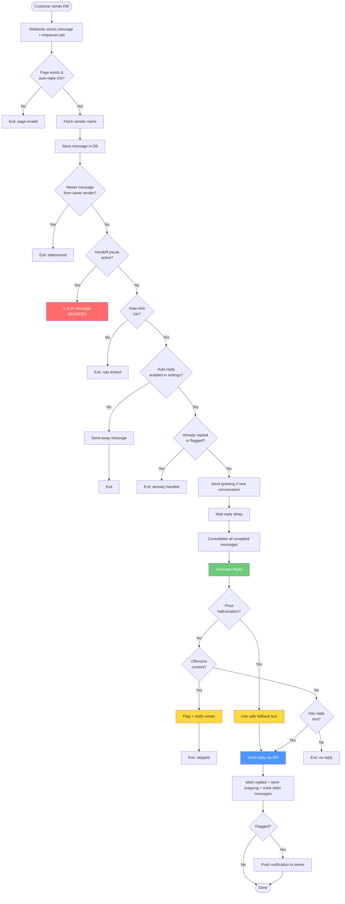
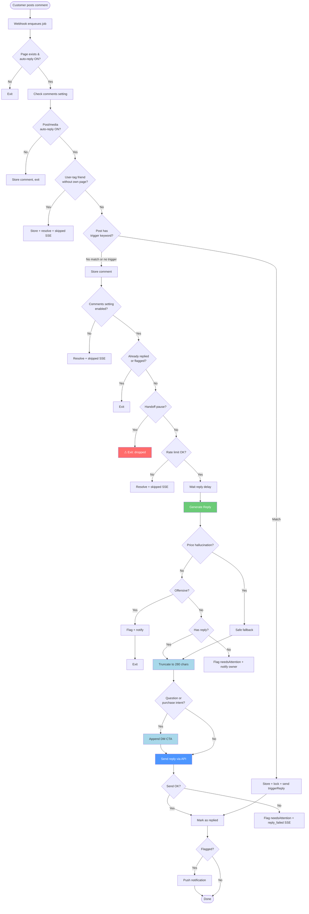
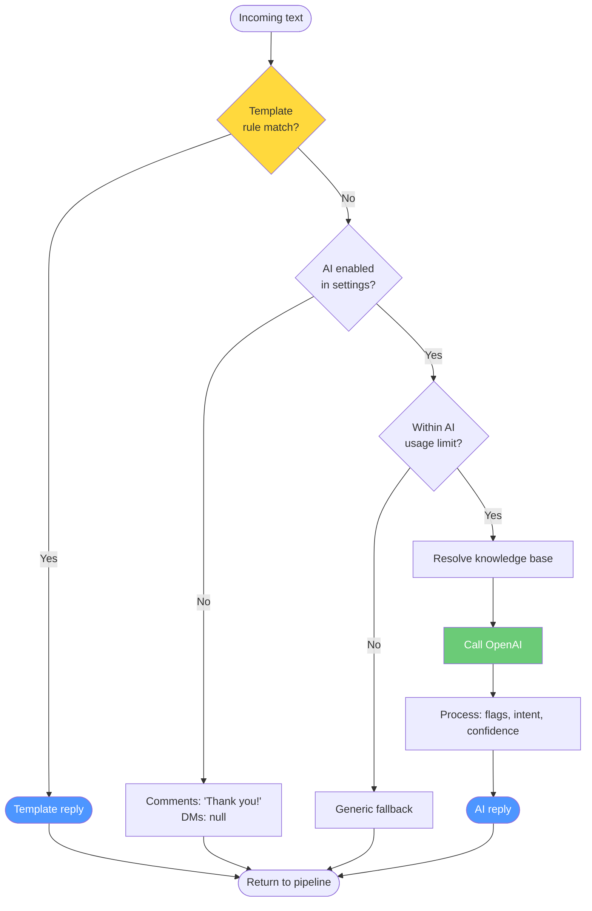
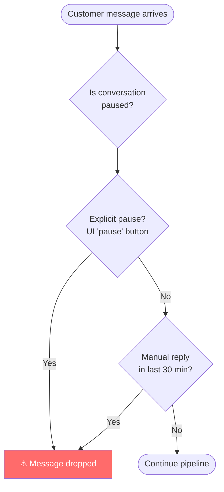
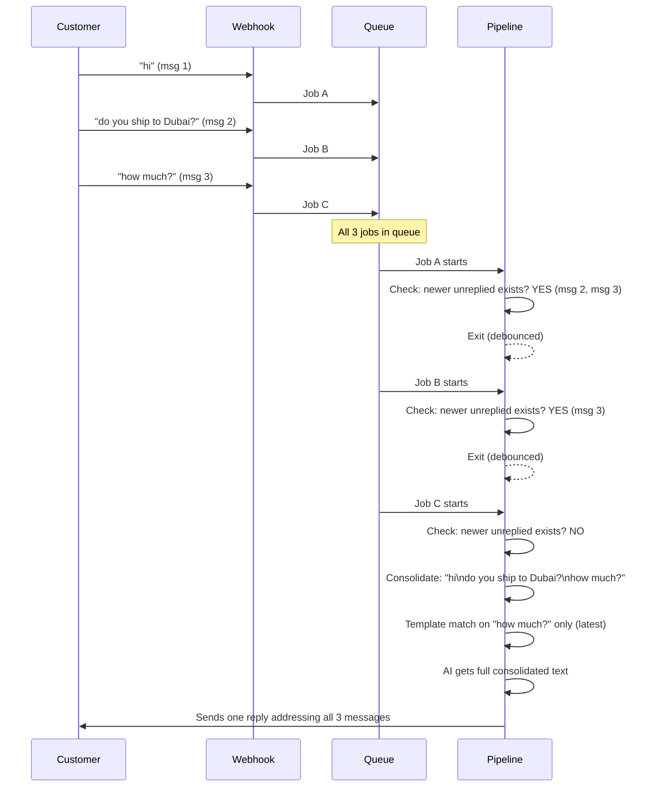

# Reply Flow

> **Last updated:** 2026-04-20
> **How to read this:** Follow the flowcharts to understand the path a message takes. Each step has an **Improve** note where relevant — these are the places to focus when making the flow better.
> **See also:** [`comment-and-message-handling.md`](../comment-and-message-handling.md) for the full behavior reference (friend-tag skip, trigger-keyword / Post Reply, pending-state invariants).

---

## Overview

```
Customer sends message/comment on Facebook or Instagram
        │
        ▼
┌─────────────────────────┐
│   Webhook receives it    │  webhook.ts
│   Verifies signature     │
│   Returns 200 instantly  │
└──────────┬──────────────┘
           │
           ▼
┌─────────────────────────┐
│   Enqueues a job in      │  replyQueue.ts
│   Redis (BullMQ)         │
└──────────┬──────────────┘
           │
           ▼
┌─────────────────────────┐
│   Worker picks up job    │  replyWorker.ts
│   Routes by type:        │
│   • facebook_comment     │
│   • facebook_message     │
│   • instagram_comment    │
│   • instagram_message    │
└──────────┬──────────────┘
           │
           ▼
┌─────────────────────────┐
│   Pipeline processes it  │  messageProcessor.ts (DMs)
│   through all steps      │  commentProcessor.ts (comments)
└──────────┬──────────────┘
           │
           ▼
┌─────────────────────────┐
│   Generate reply         │  generator.ts
│   Template → AI → None   │
└──────────┬──────────────┘
           │
           ▼
┌─────────────────────────┐
│   Send reply via         │
│   Facebook/Instagram API │
└─────────────────────────┘
```

---

## DM Pipeline (Direct Messages)

This is the most important flow — DMs are where customers expect fast, accurate replies.



### Step-by-step with improvement notes

| Step | What happens | File | Improve |
|------|-------------|------|---------|
| **Webhook** | Stores message immediately, enqueues BullMQ job | `webhook.ts` | Instagram DMs are NOT pre-stored unlike Facebook — inconsistency |
| **1-2. Validate** | Check page exists, has user, auto-reply on | `messageProcessor.ts:66-81` | — |
| **3. Sender name** | Best-effort API call to get name | `messageProcessor.ts:87-91` | Slow — could be cached better |
| **4. Store** | Save incoming message, get `isNew` flag | `messageProcessor.ts:95-102` | — |
| **5. Debounce** | Skip if newer unreplied message exists from same sender | `messageProcessor.ts:105-112` | Works well. Prevents duplicate replies |
| **6. Handoff pause** | If owner replied manually in last 30 min, OR explicit pause from UI | `messageProcessor.ts:115-121` | **BUG: message is dropped forever.** Should re-enqueue with delay |
| **7. Rate limit** | Max 10 messages/min per sender per page (Redis counter) | `messageProcessor.ts:124-130` | Limits are hardcoded. Could be per-plan |
| **8. Settings** | Check if messages auto-reply is enabled. Send away message if disabled | `messageProcessor.ts:133-148` | Away message only sent if `isNew` — repeat messages get nothing |
| **9. Already replied** | Skip if message was already processed | `messageProcessor.ts:151-154` | — |
| **9b. Greeting** | Send greeting to new conversations | `messageProcessor.ts:157-172` | Greeting + AI reply arrive back-to-back. No delay between them |
| **10. Delay** | Configurable pause before replying (feels more human) | `messageProcessor.ts:175-178` | Applied after greeting — greeting has no delay |
| **11. Consolidate** | Gather all unreplied messages from this sender | `messageProcessor.ts:182-192` | `latestMessageText` used for template match, `consolidatedText` for AI. Fixed 2026-02-16 |
| **12. Generate** | Template match → AI → null | `generator.ts` | See "Reply Generator" section below |
| **12b. Price fallback** | Replace AI reply if it hallucinated a price | `messageProcessor.ts:226-230` | Only catches `price_not_in_kb` flag. Other hallucinations pass through |
| **12c. Skip offensive** | Flag and don't reply to offensive messages | `messageProcessor.ts:233-248` | — |
| **13. Send** | Call Facebook/Instagram API | `messageProcessor.ts:256-262` | No retry on send failure — relies on BullMQ job-level retry |
| **14-16. DB updates** | Transaction: mark replied + store outgoing + mark older | `messageProcessor.ts:268-281` | Good — atomic transaction |
| **17. Notify** | Push notification if AI flagged the reply | `messageProcessor.ts:289-296` | — |

---

## Comment Pipeline



### Key differences from DMs

| | DMs | Comments |
|--|-----|----------|
| **Consolidation** | All unreplied messages merged | No — each comment standalone |
| **Template matching** | Latest message only | Comment text directly |
| **Max reply length** | No limit | 280 characters |
| **DM CTA** | No | Auto-appends "message us" for questions |
| **Greeting** | Yes (new conversations) | No |
| **Away message** | Yes (when disabled) | No |
| **Debounce** | Yes | No |

---

## Reply Generator

This is the brain of the system — where the actual reply text comes from.



### Template matching

1. Fetch user's active rules (ordered by priority, max 100)
2. Normalize text: strip Arabic diacritics, lowercase
3. For each rule's keywords:
   - **Arabic**: substring match (`text.includes(keyword)`)
   - **English**: word-boundary regex (`\bkeyword\b`)
4. First match wins → look up template → return template message

**Improve:**
- Arabic substring matching is too broad (`"شحن"` matches `"لايوجد شحن"` — shipping keyword fires on "there's no shipping")
- No multi-keyword AND logic (can't require "shipping" AND "price" together)
- No negative keywords (can't exclude matches)
- Rules checked one-by-one from DB — could be cached in memory

### AI generation

1. Check subscription limits
2. Build context: page name, KB, conversation history (DMs: last 6 messages)
3. Resolve knowledge: static KB, or RAG chunks if enabled
4. Call OpenAI → get reply + intent + confidence + flags
5. Track usage + cost

**Improve:**
- AI gets consolidated text for DMs but no indication of which messages are old vs new
- Conversation history is limited to 6 messages — long conversations lose context
- No caching of similar questions (each question = new API call)
- No A/B testing of prompts

### Knowledge resolution (RAG)

```
RAG_MODE = 'off'    → static KB text only
RAG_MODE = 'shadow' → retrieval runs + logged, but static KB sent to AI
RAG_MODE = 'on'     → retrieved chunks sent to AI, static KB omitted
```

**Improve:**
- When RAG returns 0 chunks, falls back to static KB — no blending
- Gap detector records misses but doesn't surface them to merchants yet

---

## Handoff Pause — How it works



**Current behavior:** Message is stored in DB with `replied: false` but pipeline exits. The message is never retried.

**Improve:** Re-enqueue the message as a delayed BullMQ job that fires after the pause expires. This way:
- Customer's question gets answered automatically once the owner stops chatting
- No messages fall through the cracks
- Cap retries at 3 to prevent infinite loops if owner keeps replying

---

## Debounce + Consolidation — How rapid messages work



**Improve:**
- AI gets a flat text blob — doesn't know message boundaries or timing
- If job C runs before job A (race condition), job A might process with partial context
- No consolidation for comments (each gets its own reply)

---

## Where to focus improvements (prioritized)

### High impact

| # | Problem | Where | Effort |
|---|---------|-------|--------|
| 1 | **Handoff drops messages** — customer's question goes unanswered | `messageProcessor.ts:115-121` | Medium — re-enqueue with BullMQ delay |
| 2 | **Arabic keyword matching too broad** — substring match causes false positives | `rules.ts:24-26` | Medium — consider morphological root matching or minimum length threshold |
| 3 | **No multi-keyword rules** — can't require "shipping" + "price" together | `rules.ts:168-177` | Small — add AND/OR logic to keyword matching |

### Medium impact

| # | Problem | Where | Effort |
|---|---------|-------|--------|
| 4 | **Greeting + AI reply back-to-back** — feels robotic | `messageProcessor.ts:157-178` | Small — add short delay after greeting |
| 5 | **AI doesn't see message boundaries** — consolidated text is just `\n` joined | `messageProcessor.ts:190-192` | Small — format as timestamped messages |
| 6 | **Instagram DMs not pre-stored** — inconsistent with Facebook | `webhook.ts:408-439` | Small — add pre-store like Facebook |
| 7 | **Rate limits hardcoded** — same limits for all plans | `rate-limiter.ts:8-15` | Small — make configurable per subscription tier |

### Lower priority

| # | Problem | Where | Effort |
|---|---------|-------|--------|
| 8 | **No negative keywords in rules** | `rules.ts` | Small |
| 9 | **6-message conversation history limit** | `generator.ts:167` | Small — make configurable |
| 10 | **KB gap detector doesn't surface to merchants** | `generator.ts:217` | Medium |
| 11 | **No caching for similar AI questions** | `generator.ts` | Large — semantic similarity cache |
| 12 | **Comment pipeline has no lap timers** | `commentProcessor.ts` | Small |

---

## File reference

| File | What it does |
|------|-------------|
| `backend/src/controllers/webhook.ts` | Receives webhooks, verifies signature, enqueues jobs |
| `backend/src/lib/replyQueue.ts` | BullMQ queue config, `enqueueMessage()`, `enqueueComment()` |
| `backend/src/workers/replyWorker.ts` | Consumes jobs, routes to correct service. Concurrency: 5 |
| `backend/src/services/reply/index.ts` | Facebook service — routes to processors via adapters |
| `backend/src/services/instagramReply.ts` | Instagram service — same pattern |
| `backend/src/services/reply/messageProcessor.ts` | 17-step DM pipeline |
| `backend/src/services/reply/commentProcessor.ts` | 12-step comment pipeline |
| `backend/src/services/reply/generator.ts` | Reply generation: template → AI → fallback |
| `backend/src/services/rules.ts` | Keyword matching engine |
| `backend/src/services/messages.ts` | Store, pause, debounce, consolidation |
| `backend/src/services/reply/adapters/` | Platform adapters (Facebook, Instagram) |
| `backend/src/services/protection/rate-limiter.ts` | Redis rate limiting |
| `backend/src/lib/pipelineMetrics.ts` | Outcome tracking per pipeline |
